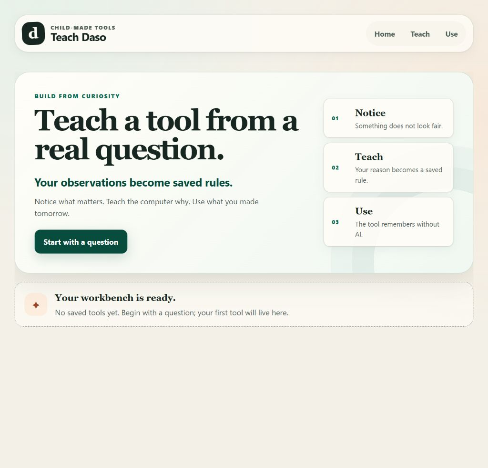
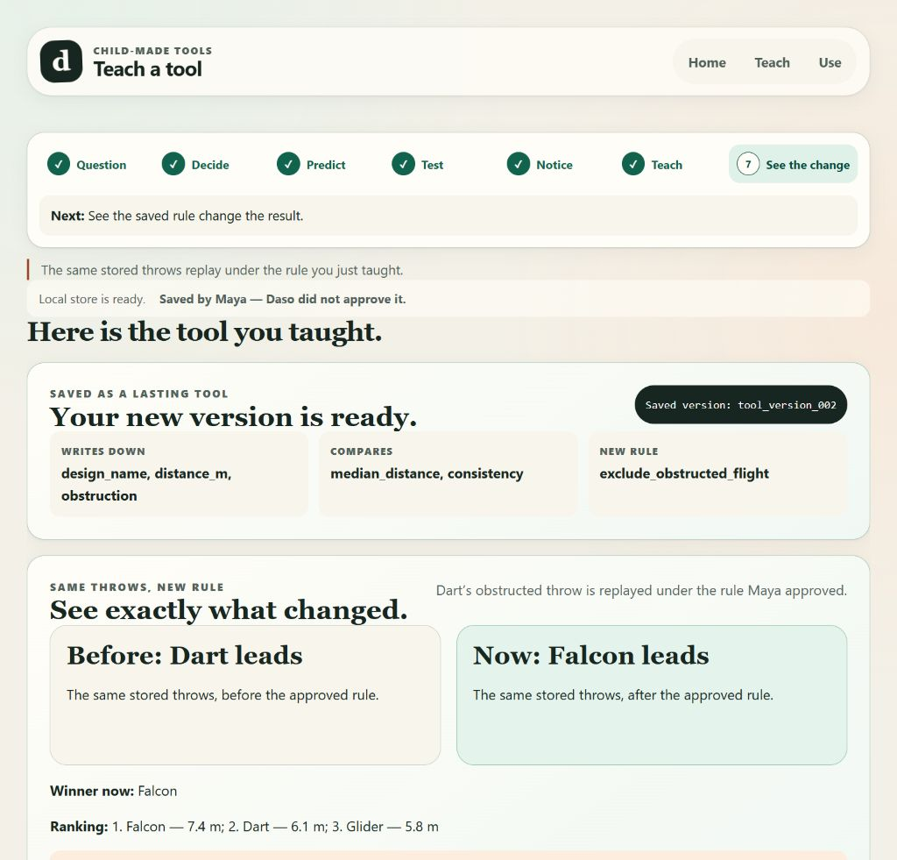

# Teach Daso

**The computer that grows with your child should grow because of your child.**

A child notices something, teaches a lasting rule, sees the result change, and another child can use it later. A parent can see why. Flight Lab is the only implemented tool.



This is a local tablet prototype. It is not affiliated with or endorsed by Daso.

## The idea

Teach Daso explores one adjacent question: can a child teach their computer a durable capability without quietly handing authorship to the AI?

The answer here is deliberately narrow and executable. Maya defines what “best” means, records real observations, notices an unfair throw, explains why, and approves the change. The AI may suggest; it cannot approve. Her words compile into an immutable version, the same observations replay deterministically, and the saved tool runs later with no model call.

| What a founder sees | What the architecture proves |
|---|---|
| **Before: Dart leads → Now: Falcon leads** | One approved rule changed one stored trial’s validity; the runtime replay is deterministic. |
| **Maya taught this rule** | Material behavior is equal to the fold of approved authorship events. |
| **Saved rules — works without AI** | Runner cannot reach either model role and uses the active immutable version. |
| **Parent evidence** | Every narrative clause is projected from local records and cites evidence that exists. |



## Run locally

```text
npm install
npm run dev
```

Open `http://localhost:3000`. Teaching stays scripted so the path works with the network off.

```text
npm run typecheck
npm run lint
npm test
npm run build
```

## 90-second product path

1. Home: **Start with a question**.
2. Teach: question → what “best” means → what to write down → a guess (not stored as a result) → real throws.
3. Notice the 8.9 m Dart throw that touched something. Maya says why. Approve the rule. Daso cannot approve it.
4. See the same stored throws replay under v2: Dart is no longer counted; Falcon leads.
5. Home → **Let Leo try this** → **Make my copy**. Runner works from saved rules, without AI.
6. **Parent evidence** shows the grounded story. Delete is real.

Demo script and frames: `docs/demo/README.md`. Closing line: **Maya didn't download this tool. She taught it.**

## Limitations and simulations

Flight Lab is the only tool kind. There is no sign-in, analytics, public sharing, cloud sync, or camera that measures distance.

| Simulated | What is real | Where you are told |
|---|---|---|
| Automatic detection of how far a paper airplane flew. | The child enters or confirms the measured distance, and that recorded observation is what the metrics and the replay actually use. | Capture screen; this README |
| Computer vision deciding that a flight touched something. | The child's own judgement, recorded as an observation, and the taught rule that acts on it. | Capture screen; this README |
| Delivery of the summary to a parent by SMS or push notification. | On-device generation of the summary and the check that every claim it makes cites an event that exists. | Parent view; this README |
| Separate accounts and authentication for the second child on day two. | Fork semantics and rule inheritance: the second child's session runs Maya's approved rules and cannot alter her version. | Runner; this README |

Honest product-spec deviations:

- **D-01:** Approval is a separate child-actor ledger entry, not a boolean the event author flips.
- **D-02:** Which design Maya predicted is not stored, so no product screen invents that prediction.

## Routes

`/` Home · `/journey` Teach · `/run` Runner · `/parent` Parent evidence · `/inspect` inspection projection · `/api/agents/teaching` and `/api/agents/evidence` (the only two model paths)

## Docs

- Architecture: `docs/ARCHITECTURE.md`
- Threat model: `docs/THREAT_MODEL.md`
- Evidence: `docs/evidence/`
- Demo: `docs/demo/README.md`
