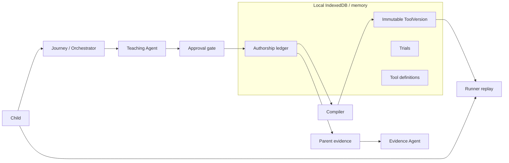

# Teach Daso architecture

Flight Lab is the only implemented tool. The kernel is portable; Next.js is the tablet host.

## Closed authority

| Who | May | May not |
|---|---|---|
| Child | Approve, reject, record observations, teach a rule | Edit past events |
| Teaching Agent | Offer structured candidates | Approve, write a version, reach Runner |
| Evidence Agent | Return a closed id list | Write summaries or invent facts |
| Compiler / runtime | Fold approved events; replay stored trials | Call a model |
| Runner | Replay the active version | Import teaching or evidence code |

Model access exists at exactly two files: `src/app/api/agents/teaching/route.ts` and `src/app/api/agents/evidence/route.ts`.

## Data flow

1. Orchestrator states and events are a total table (`src/core/orchestrator`). No eleventh state.
2. Approved candidates append to the ledger. A version body equals the fold of approved events (R1).
3. Trials stamp the active version id at capture. Replay never rewrites history.
4. A second child receives an independently owned fork with a re-keyed ledger. `tools.save` cannot write `forkedFrom`.
5. Parent evidence projects one tool graph, validates a closed selection, and stores `ParentSummary` only from that projection.

## Storage

Seven repository families: profiles, tools, versions, ledger, trials, grants, summaries. No eighth store. Deletes are whole-graph and failure-atomic. After a source profile is deleted, a surviving fork keeps an anonymous title and teacher; `forkedFrom` remains unresolvable provenance.

## Invariant map

| Concern | Tests |
|---|---|
| Two model roles only | INV-01, INV-38, INV-48, INV-52, INV-73, INV-79 |
| Deterministic orchestrator | INV-17, INV-36, INV-37 |
| Child approval, no self-approve | INV-10, INV-41, INV-47, INV-56 |
| Provenance and fold equality | INV-09, INV-11, INV-20, INV-21 |
| Runner has no model | INV-22, INV-43, INV-79 |
| Local-first deletion | INV-25, INV-26, INV-31, INV-76 |
| Parent grounding | INV-24, INV-74, INV-75, INV-78 |
| Fork reuse and orphan privacy | INV-23, INV-66–INV-71, INV-77 |
| Founder experience | INV-80–INV-83 |

D-01 and D-02 are recorded in `docs/BUILD_STATE.md`.
