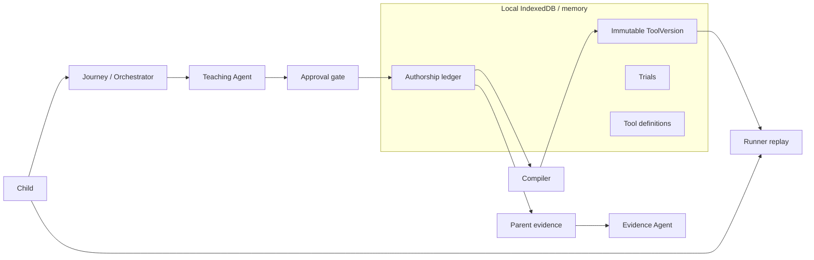

# Kale Memory Lab architecture

Draw and Flight Lab are the current two-slice capability proof. The kernel is portable; Next.js is the browser/tablet host. Older writing and experiment-builder routes remain available as legacy prototypes, not claims that their orchestrator drives the new Draw workbench.

## Shared capability primitive

`child work + intent → bounded interpretation → grounding → visible review → child approval → immutable version → deterministic reuse`.

Draw retains the exact selected vector mark; the model does not discover, redraw or beautify it. Flight retains a selected recorded obstruction and a same-distance clear contrast. Both call `beginCapabilityReview` and the same `commitApprovedCapability` repository boundary. Only a child-approval event can save a version or move the active pointer. Manual choices are never credited to AI.

New reviews also retain local owner, trusted context and (for Draw) the reviewed guide path. These fields are optional when decoding older history; missing history is labelled, never retroactively invented. Runtime geometry and Flight ranking remain domain-specific pure executors.

## Draw-first presentation (Phase 10)

`/` and `/draw` host one studio: creation stays mounted while the user switches to deterministic reuse. The artwork precedes the context dock on small screens. Mark confirmation and child-chosen keyboard path endpoints supplement pointer input; freehand drawing is still pointer-based. The immutable initial proposal and later child edits are displayed separately. Save success appears only after the existing approved-capability commit finishes; an ephemeral memory fallback cannot advertise a durable save.

New labelled Draw practice belongs to `child_kale_practice_01`. The explicitly confirmed practice reset calls the existing atomic profile-graph deletion for that owner only, not a database clear. Real blank drawings, legacy practice and Flight graphs remain separate. Tests cover scope, idempotency and rollback; concurrent reset versus an in-flight writer still needs Phase 11 hardening. Earlier writing is preserved at `/writing`. No capability vocabulary, object store, database version or model route is added by this presentation phase.

The app-owned axe control is local and development-only. It checks a visible DOM state and reports incomplete checks, not universal accessibility compliance.

## Local parent evidence and data rights

`/parent/tools` reads a tool graph from one memory snapshot or one IndexedDB read transaction. It verifies ownership, history, active version, approval/control correspondence and local source context before rendering. Human work and choices lead; IDs and SHA-256 canonical-input/output receipts sit in an expandable section. Unknown profiles are labelled “Child on this device”, not given an invented name.

The v2 closed-ID evidence projection and selector are local. The optional selector seam is stub-tested only; no new external evidence payload or model call is enabled. Deterministic code writes the story and makes no mastery, emotion or developmental assessment. The legacy `/parent` evidence path is unchanged.

Canonical v2 export includes the scoped graph, artwork copies, versions, ledger and runs explicitly labelled `recomputed_for_evidence`. Those are new local replays, not a stored usage history. SHA-256 checks bytes and reproducibility, not authentication or a cryptographic signature.

Deleting a source drawing leaves a disclosed immutable mark copy and retained reviewed path in its saved tool. Deleting that tool removes the copy and its review graph; deleting the local child removes their profile, owned tools, unfinished reviews and artwork together, failure-atomically. Historical ownerless unsaved Kale reviews and pre-review Flight practice records use the old fixed `child_local_01` compatibility owner, without overriding a saved definition’s owner. Existing legacy fork deletion/anonymity remains unchanged. Downloaded files and another browser/device are outside these deletion operations.

## Legacy experiment-builder architecture

```mermaid
flowchart LR
  child[Child] --> journey[Journey / Orchestrator]
  journey --> teaching[Teaching Agent]
  teaching --> gate[Approval gate]
  gate --> ledger[Authorship ledger]
  ledger --> compiler[Compiler]
  compiler --> version[Immutable ToolVersion]
  version --> runner[Runner replay]
  child --> runner
  ledger --> parent[Parent evidence]
  parent --> evidence[Evidence Agent]
  subgraph storage [Local IndexedDB / memory]
    ledger
    version
    trials[Trials]
    tools[Tool definitions]
  end
```

## Closed authority

| Who | May | May not |
|---|---|---|
| Child | Approve, reject, record observations, teach a rule | Edit past events |
| Teaching Agent | Offer structured candidates | Approve, write a version, reach Runner |
| Evidence Agent | Return a closed id list | Write summaries or invent facts |
| Compiler / runtime | Fold approved events; replay stored trials | Call a model |
| Runner | Replay the active version | Import teaching or evidence code |

Model access exists at exactly two files: `src/app/api/agents/teaching/route.ts` and `src/app/api/agents/evidence/route.ts`.

## Data flow

1. Orchestrator states and events are a total table (`src/core/orchestrator`). No eleventh state.
2. Approved candidates append to the ledger. A version body equals the fold of approved events (R1).
3. Trials stamp the active version id at capture. Replay never rewrites history.
4. A second child receives an independently owned fork with a re-keyed ledger. `tools.save` cannot write `forkedFrom`.
5. Parent evidence projects one tool graph, validates a closed selection, and stores `ParentSummary` only from that projection.

## Storage

The original seven repository families (profiles, tools, versions, ledger, trials, grants, summaries) are joined by Draw assets and shared capability lifecycle ports. IndexedDB remains at version 3; Phase 9 adds no object store, repository family or dependency. Deletes are whole-graph and failure-atomic. After a source profile is deleted, a surviving legacy fork keeps an anonymous title and teacher; `forkedFrom` remains unresolvable provenance.

## Invariant map

| Concern | Tests |
|---|---|
| Two model roles only | INV-01, INV-38, INV-48, INV-52, INV-73, INV-79 |
| Deterministic orchestrator | INV-17, INV-36, INV-37 |
| Child approval, no self-approve | INV-10, INV-41, INV-47, INV-56 |
| Provenance and fold equality | INV-09, INV-11, INV-20, INV-21 |
| Runner has no model | INV-22, INV-43, INV-79 |
| Local-first deletion | INV-25, INV-26, INV-31, INV-76 |
| Parent grounding | INV-24, INV-74, INV-75, INV-78 |
| Fork reuse and orphan privacy | INV-23, INV-66–INV-71, INV-77 |
| Founder experience | INV-80–INV-83 |

D-01 and D-02 are summarized in the README under **Honest product-spec deviations**.
