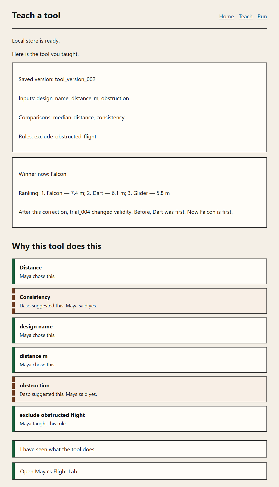

# Phase 5 evidence packet

**Date:** 2026-08-21
**Spec:** `docs/phases/PHASE_05.md` section D.4
**Build ledger:** `docs/BUILD_STATE.md`
**Branch:** `orchestration/phase-05-plan`
**Status:** Review blockers addressed and gated. Not architecturally accepted.

---

## 1. Gate commands

All four exited zero. No network was required beyond the already-installed `node_modules`.
No command called a live model.

### Targeted invariant files (D.3)

```
npx vitest run tests/invariants/inv-20-replay.test.ts tests/invariants/inv-21-obstructed-ranking.test.ts tests/invariants/inv-57-atomic-compilation.test.ts tests/invariants/inv-58-no-dangling-active-version.test.ts tests/invariants/inv-59-idempotent-compilation.test.ts tests/invariants/inv-60-version-history-immutable.test.ts tests/invariants/inv-61-runtime-pure.test.ts tests/invariants/inv-62-metric-ranking-contract.test.ts tests/invariants/inv-63-trial-resolves-active-version.test.ts tests/invariants/inv-64-phase-05-reload-proof.test.ts

 Test Files  10 passed (10)
      Tests  23 passed (23)
```

Exit 0.

### `npm run typecheck`

```
> tsc --noEmit
```

Exit 0. No diagnostics.

### `npm run lint`

```
> eslint src tests eslint.config.mjs vitest.config.ts next.config.ts
```

Exit 0. No errors, no warnings.

### `npm test`

```
 Test Files  65 passed | 4 skipped (69)
      Tests  207 passed | 4 todo (211)
```

Exit 0.

Passing identifiers: INV-01 … INV-21 and INV-26 … INV-64.
Pending identifiers (vitest `todo`, each naming its owning phase): INV-22 … INV-25.

Phase 1–4 invariants still pass. INV-20 and INV-21 are promoted from pending to asserted.
INV-45's orchestrator scan is unchanged; its journey assertion now expects the two compiled
versions that C.6 requires.

### `npm run build`

```
Route (app)
┌ ○ /
├ ○ /_not-found
├ ƒ /api/agents/teaching
├ ○ /inspect
├ ○ /journey
└ ○ /run
```

Exit 0. No evidence route. No new model path.

---

## 2. Invariant table

| ID | State | Assertion observed |
|---|---|---|
| INV-01 … INV-19 | **Asserted** | Unchanged from Phase 4 |
| INV-20 | **Asserted** | Repeated `replay` of the same version and trials is byte-identical; inputs unchanged |
| INV-21 | **Asserted** | trial_004 valid and Dart first under v1; only trial_004 becomes invalid under v2; Dart 6.1 m; Falcon 7.4 m and first; stored trials unchanged |
| INV-22 … INV-25 | **Pending** | P6/P7 |
| INV-26 … INV-56 | **Asserted** | Unchanged from Phase 4 except INV-39/INV-45 journey expectations noted below |
| INV-57 | **Asserted** | Memory and IndexedDB: commit v1, then injected failure while activating v2 leaves v1 active and v2 absent; duplicate of v1 does not move the pointer |
| INV-58 | **Asserted** | No placeholder in `src/ui/**`; journey stores no tool before v1; reopen resolves `currentVersionId` to same-tool v2 |
| INV-59 | **Asserted** | Second compile of an unchanged ledger: zero id calls, zero clock calls, zero writes; version bytes unchanged |
| INV-60 | **Asserted** | After v2, v1 nested mutation throws; definition points at v2; both versions readable |
| INV-61 | **Asserted** | Compiler/runtime import scan is core-only; replay writes no repository and mutates nothing |
| INV-62 | **Asserted** | Odd/even median, millimetre rounding, spread, both-metric order, median-only, consistency-only, no-metrics (no ranking/winner), inactive metric omitted from output and ranking |
| INV-63 | **Asserted** | Capture stamps repository-resolved `tool_version_001`; missing/dangling/cross-tool rejected before save via mocked `tools.get`; UI sites do not mention `toolVersionIdAtCapture` |
| INV-64 | **Asserted** | Memory and IndexedDB/reopen: v1, four trials, v2, both rankings, unmodified ledger/trials |

INV-39 still reaches `RUN` with a fold equal to the §9.3 body; it now also expects two stored versions.
INV-45 still forbids version writes inside `src/core/orchestrator/**`; the journey now persists v1 and v2 through composition.

---

## 3. Canonical compiled versions

Fixture compiler metadata (`compiledAt` from injected ports, matching §9.3 for v2):

```
CANONICAL_V1_FIXTURE {"compiledAt":"2026-08-18T10:21:00Z","inputs":["design_name","distance_m","obstruction"],"metrics":["median_distance","consistency"],"rules":[],"toolId":"mayas-flight-lab","version":1,"versionId":"tool_version_001"}
CANONICAL_V2_FIXTURE {"compiledAt":"2026-08-18T10:31:00Z","inputs":["design_name","distance_m","obstruction"],"metrics":["median_distance","consistency"],"rules":[{"effect":{"set":"trial.valid","value":false},"ruleId":"exclude_obstructed_flight","sourceEventId":"event_014","when":{"equals":true,"field":"obstruction"}}],"toolId":"mayas-flight-lab","version":2,"versionId":"tool_version_002"}
```

Scripted journey (fixed clock `2026-08-18T10:13:00Z`):

```
JOURNEY_V1 {"compiledAt":"2026-08-18T10:13:00Z","inputs":["design_name","distance_m","obstruction"],"metrics":["median_distance","consistency"],"rules":[],"toolId":"mayas-flight-lab","version":1,"versionId":"tool_version_001"}
JOURNEY_V2 {"compiledAt":"2026-08-18T10:13:00Z","inputs":["design_name","distance_m","obstruction"],"metrics":["median_distance","consistency"],"rules":[{"effect":{"set":"trial.valid","value":false},"ruleId":"exclude_obstructed_flight","sourceEventId":"event_014","when":{"equals":true,"field":"obstruction"}}],"toolId":"mayas-flight-lab","version":2,"versionId":"tool_version_002"}
```

v1 bodies are identical aside from `compiledAt`/`versionId`. After v2 exists, INV-60 shows the stored v1 bytes still match that v1 snapshot and reject mutation.

---

## 4. Canonical replay

```
REPLAY_V1 {"insufficient":[],"metrics":[{"consistencyMm":2800,"designName":"Dart","medianDistanceMm":7500,"validTrialCount":2},{"consistencyMm":0,"designName":"Falcon","medianDistanceMm":7400,"validTrialCount":1},{"consistencyMm":0,"designName":"Glider","medianDistanceMm":5800,"validTrialCount":1}],"projections":[{"trialId":"trial_001","validUnderCurrentVersion":true},{"trialId":"trial_002","validUnderCurrentVersion":true},{"trialId":"trial_003","validUnderCurrentVersion":true},{"trialId":"trial_004","validUnderCurrentVersion":true}],"ranking":[{"consistencyMm":2800,"designName":"Dart","medianDistanceMm":7500,"rank":1},{"consistencyMm":0,"designName":"Falcon","medianDistanceMm":7400,"rank":2},{"consistencyMm":0,"designName":"Glider","medianDistanceMm":5800,"rank":3}],"versionId":"tool_version_001","winner":"Dart"}
REPLAY_V2 {"insufficient":[],"metrics":[{"consistencyMm":0,"designName":"Falcon","medianDistanceMm":7400,"validTrialCount":1},{"consistencyMm":0,"designName":"Dart","medianDistanceMm":6100,"validTrialCount":1},{"consistencyMm":0,"designName":"Glider","medianDistanceMm":5800,"validTrialCount":1}],"projections":[{"trialId":"trial_001","validUnderCurrentVersion":true},{"trialId":"trial_002","validUnderCurrentVersion":true},{"trialId":"trial_003","validUnderCurrentVersion":true},{"trialId":"trial_004","validUnderCurrentVersion":false}],"ranking":[{"consistencyMm":0,"designName":"Falcon","medianDistanceMm":7400,"rank":1},{"consistencyMm":0,"designName":"Dart","medianDistanceMm":6100,"rank":2},{"consistencyMm":0,"designName":"Glider","medianDistanceMm":5800,"rank":3}],"versionId":"tool_version_002","winner":"Falcon"}
```

Dart median 7500 mm = 7.5 m under v1; 6100 mm = 6.1 m under v2. Falcon remains 7400 mm = 7.4 m.

Flight Lab versions include both metrics, so both fields appear. INV-62 also proves: median-only omits `consistencyMm` and ranks by median then name; consistency-only omits `medianDistanceMm` and ranks by spread then name; no metrics yields empty ranking and no winner.

---

## 5. Atomic failure / rollback

Observed against both memory and IndexedDB (INV-57 and repository conformance):

| Step | After v1 commit | After injected failure while activating v2 | After duplicate of existing v1 |
|---|---|---|---|
| `toolVersions[tool_version_001]` | present | still present | present |
| `toolVersions[tool_version_002]` | absent | still absent | absent |
| `tools.currentVersionId` | `tool_version_001` | still `tool_version_001` | still `tool_version_001` |
| error | — | `injected compilation failure after version write` | `PersistenceError` duplicate version |

`tools.save` also rejects a missing version and a version owned by another tool; the previous definition bytes are unchanged. IndexedDB validates the pointer inside the same read-write transaction as the put.

The IndexedDB compilation path uses one read-write transaction over `toolVersions` and `tools`. Abort awaits `tx.done` so the rollback is not an unhandled `AbortError`.

---

## 6. IndexedDB reopen

INV-58 and INV-64: close the connection after the full scripted journey, reopen from a fresh `openIndexedDbRepositories` call.

- definition `currentVersionId` is `tool_version_002`
- `versions.get('tool_version_002')` exists and `toolId` is `mayas-flight-lab`
- `versions.get('tool_version_001')` still exists with empty rules
- ledger and trial canonical JSON are unchanged
- replay of stored v1 still ranks Dart first; stored v2 ranks Falcon first

---

## 7. Transition amendment and placeholder removal

P3 table, only the already-frozen compile intent is added. No new state or event:

```
-    inputs_confirmed: advance('PREDICT'),
+    inputs_confirmed: advance('PREDICT', ['request_compile']),
```

`REVIEW_MUTATION + candidate_approved` already emitted `request_compile`; that cell is unchanged.

Placeholder removal (live flow no longer seeds a dangling `currentVersionId`):

```
-  FLIGHT_LAB_VERSION_PLACEHOLDER,
...
-      const tool = await repositories.tools.get(FLIGHT_LAB_TOOL_ID);
-      if (tool === null) {
-        await repositories.tools.save(
-          ToolDefinition.parse({
-            ...
-            currentVersionId: FLIGHT_LAB_VERSION_PLACEHOLDER,
```

Trial drafts no longer carry `toolVersionIdAtCapture`. Capture stamps the repository-resolved active version.

---

## 8. Changed file tree and import-boundary scan

Created:

```
src/core/compiler/compile.ts
src/core/compiler/index.ts
src/core/runtime/types.ts
src/core/runtime/rules.ts
src/core/runtime/metrics.ts
src/core/runtime/replay.ts
src/core/runtime/index.ts
src/adapters/persistence/atomicCommit.ts
src/adapters/persistence/definitionPointer.ts
tests/unit/compiler/compile.test.ts
tests/unit/runtime/metrics.test.ts
tests/unit/runtime/rules.test.ts
tests/integration/phase-05-compile-replay.test.ts
tests/invariants/inv-57-atomic-compilation.test.ts
tests/invariants/inv-58-no-dangling-active-version.test.ts
tests/invariants/inv-59-idempotent-compilation.test.ts
tests/invariants/inv-60-version-history-immutable.test.ts
tests/invariants/inv-61-runtime-pure.test.ts
tests/invariants/inv-62-metric-ranking-contract.test.ts
tests/invariants/inv-63-trial-resolves-active-version.test.ts
tests/invariants/inv-64-phase-05-reload-proof.test.ts
docs/evidence/PHASE_05.md
docs/evidence/assets/phase-05-compile-preview-v2.png
docs/evidence/assets/capture-compile-preview.mjs
```

Amended (owned or decision-logged):

```
src/core/ports/repositories.ts
src/adapters/persistence/memory/versions.ts
src/adapters/persistence/indexedDb/versions.ts
src/adapters/persistence/index.ts
src/adapters/persistence/memory/tools.ts
src/adapters/persistence/indexedDb/tools.ts
src/adapters/persistence/indexedDb/access.ts
src/core/orchestrator/transition.ts
src/ui/flows/executeIntents.ts
src/ui/flows/JourneyFlow.tsx
src/ui/screens/CompilePreviewScreen.tsx
src/adapters/teaching/scripted.ts
tests/conformance/repositories.ts
tests/fixtures/script/flightLab.ts
tests/journey/runScriptedJourney.ts
tests/invariants/inv-20-replay.test.ts
tests/invariants/inv-21-obstructed-ranking.test.ts
tests/invariants/inv-39-scripted-journey.test.ts
tests/invariants/inv-45-no-version-write.test.ts
docs/BUILD_STATE.md
```

`atomicCommit.ts` is an extra persistence path: a test-only abort switch so INV-57 can fail after the version row is written. Production callers never set it.

`definitionPointer.ts` is the shared missing/cross-tool check used by both `tools.save` implementations. IndexedDB `tools.save` reads `toolVersions` and writes `tools` in one transaction.

`persistGraph` saves versions before tools so a valid pointer can exist at definition write time.

Compiler imports (all `src/core`): `ledger/fold`, `ledger/types`, `schema/primitives`, `schema/toolVersion`, `serialization/canonicalJson`, `serialization/deepFreeze`.

Runtime imports: `zod` (types only), `schema/experimentTrial`, `schema/toolVersion`, `schema/vocabulary`, `schema/primitives`, plus sibling runtime modules. INV-61 scan found no adapter, app, UI, browser, Node I/O, clock, or randomness seam.

---

## 9. Compile preview v1→v2 visual evidence (D.4.9)

The real browser journey was driven through definition, four trials, obstruction correction, and v2 compile. Screenshot (not expected text):



The captured frame shows, together:

- `Saved version: tool_version_002`
- `Rules: exclude_obstructed_flight`
- `Winner now: Falcon`
- `After this correction, trial_004 changed validity. Before, Dart was first. Now Falcon is first.`
- ranking `1. Falcon — 7.4 m; 2. Dart — 6.1 m; 3. Glider — 5.8 m`

Reproduction (not a product path; Playwright is not a `package.json` dependency):

`docs/evidence/assets/capture-compile-preview.mjs` against `npm run dev` on `http://localhost:3000/journey`, scripted teaching source, fresh Edge profile.

`CompilePreviewScreen` still renders `version.versionId` and `runtime` / `previousRuntime` from `executeIntents`. Authorship remains the existing `WhyPanel` projection. No P6 runner tile or fork UI was added.

---

## 10. Deviations

No undeclared deviations. This packet does not claim architectural acceptance.
