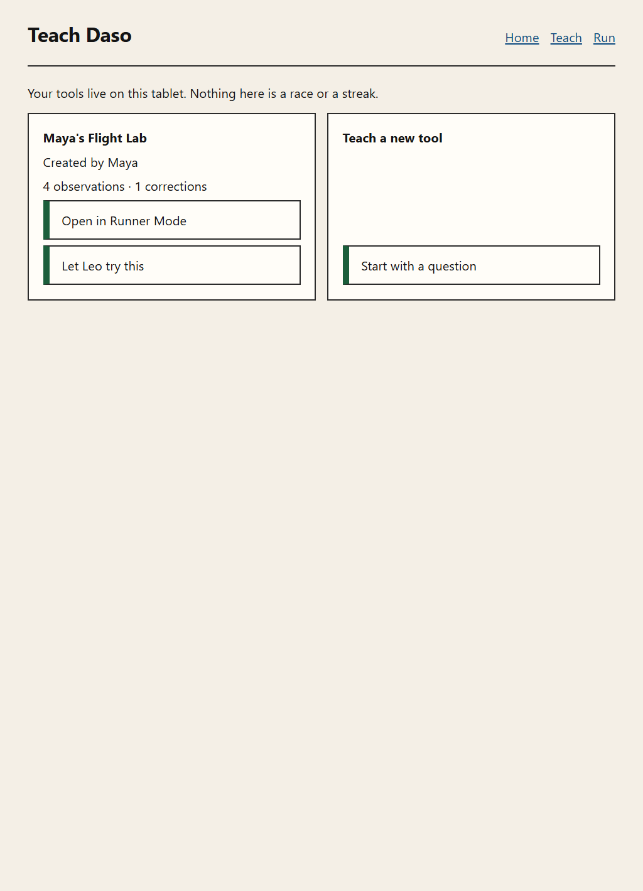
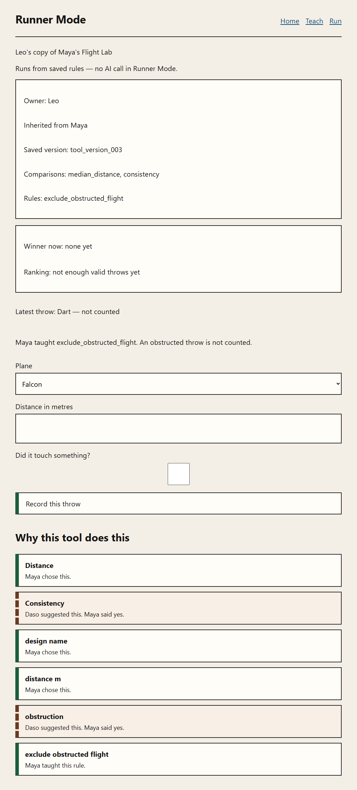

# Phase 6 evidence packet

**Date:** 2026-08-23
**Spec:** `docs/phases/PHASE_06.md` section E.4
**Build ledger:** `docs/BUILD_STATE.md`
**Branch:** `orchestration/phase-06-plan`
**Commit SHA:** `e242f190c8db40d54a89d5f3d19e2d8f2196c187`
**Implementation commit:** `2c2960b5ea549b2c592c0e190154c1ff9501997c`
**Status:** Review blockers addressed and gated. Not architecturally accepted.

---

## 1. Gate commands

All four exited zero on the submitted tree. No network was required beyond the already-installed `node_modules`. No command called a live model.

### Targeted invariant files (E.3)

```
npx vitest run tests/invariants/inv-22-runner-mode.test.ts tests/invariants/inv-23-fork.test.ts tests/invariants/inv-65-saved-tile-grounding.test.ts tests/invariants/inv-66-fork-provenance.test.ts tests/invariants/inv-67-atomic-fork.test.ts tests/invariants/inv-68-fork-idempotency.test.ts tests/invariants/inv-69-runner-active-version.test.ts tests/invariants/inv-70-day-two-rule.test.ts tests/invariants/inv-71-phase-06-reload-proof.test.ts tests/invariants/inv-72-runner-integrity-failure.test.ts

 Test Files  10 passed (10)
      Tests  14 passed (14)
```

Exit 0.

Memory and IndexedDB exclusive-write, re-key, and rollback also ran through `tests/invariants/inv-30-two-implementations.test.ts` (conformance helper `tests/conformance/repositories.ts`).

### `npm run typecheck`

```
> tsc --noEmit
```

Exit 0. No diagnostics.

### `npm run lint`

```
> eslint src tests eslint.config.mjs vitest.config.ts next.config.ts
```

Exit 0. No errors, no warnings.

### `npm test`

Recorded from the final tree after the production build (INV-52 reads `.next/static`):

```
 Test Files  79 passed | 2 skipped (81)
      Tests  236 passed | 2 todo (238)
```

Exit 0.

Passing identifiers: INV-01 … INV-23 and INV-26 … INV-72. Pending identifiers (vitest `todo`, each naming its owning phase): INV-24, INV-25.

### `npm run build`

```
Route (app)
┌ ○ /
├ ○ /_not-found
├ ƒ /api/agents/teaching
├ ○ /inspect
├ ○ /journey
└ ○ /run
```

Exit 0. No evidence route. No new model path.

---

## 2. Invariant table

| ID | State | Assertion observed |
|---|---|---|
| INV-01 … INV-21 | **Asserted** | Unchanged from Phase 5 |
| INV-22 | **Asserted** | `/run` import graph reaches no teaching/agent/orchestrator/executeIntents/model path; load/capture/replay succeed while `fetch` throws |
| INV-23 | **Asserted** | Leo-owned fork + capture leave Maya definition/versions/ledger/trials/grants/summaries byte-identical |
| INV-24 … INV-25 | **Pending** | P7 |
| INV-26 … INV-64 | **Asserted** | Unchanged from Phase 5 except INV-63 now allows the extracted capture service to stamp `toolVersionIdAtCapture` |
| INV-65 | **Asserted** | Tile name/creator/4 observations/1 correction come from stored data; UI has no fixture-only “9/2” |
| INV-66 | **Asserted** | Complete ledger re-keyed, approvals remapped, version compiled from target fold, lineage exact, no trials copied, source bytes unchanged |
| INV-67 | **Asserted** | Memory and IndexedDB: success writes one target graph; injected failure, exclusive-write rejection, and adversarial incomplete/colliding/gapped/same-owner forks leave no target and unchanged Maya bytes |
| INV-68 | **Asserted** | Second reuse returns the same fork; id/time counters do not advance |
| INV-69 | **Asserted** | Ready load equals `replay` of stored `tool_version_002`; missing tool is empty |
| INV-70 | **Asserted** | Obstructed Day-2 trial stamped with the fork version, stored only on the fork, projected invalid, attributed to Maya |
| INV-71 | **Asserted** | IndexedDB close/reopen retains source, fork lineage/ledger/version/trial, and byte-identical replay |
| INV-72 | **Asserted** | Empty ledger → child-safe integrity error; capture throws; Maya still has four trials |

---

## 3. Canonical Maya graph before and after Day-2

`mayaGraphCanonical` hashes definition, every version, complete ledger, trials, grants, and summaries for `mayas-flight-lab`.

```
MAYA_UNCHANGED true
```

Before and after the application-path fork + obstructed trial are identical:

```
MAYA_BEFORE {"definition":{"createdAt":"2026-08-18T10:12:00Z","currentVersionId":"tool_version_002","displayName":"Maya's Flight Lab","kind":"experiment_comparator","ownerChildId":"child_local_01","toolId":"mayas-flight-lab"},"grants":[{"approvedBy":"parent_or_device_policy","capability":"camera_foreground_capture","expiresAt":"2026-08-18T11:00:00Z","grantId":"grant_camera_flight_lab","scope":"current_experiment","toolId":"mayas-flight-lab"}],"ledger":[{"actor":"child","candidateMutation":{"metric":"median_distance","operation":"add_metric"},"createdAt":"2026-08-18T10:13:00Z","entryKind":"candidate","eventId":"event_001","originalInput":"I want to know which paper airplane flies the farthest","sequence":1,"toolId":"mayas-flight-lab","type":"definition_decision"},{"actor":"child","approves":"event_001","createdAt":"2026-08-18T10:13:20Z","entryKind":"approval","eventId":"event_002","sequence":2,"toolId":"mayas-flight-lab"},{"actor":"ai","candidateMutation":{"metric":"consistency","operation":"add_metric"},"createdAt":"2026-08-18T10:14:00Z","entryKind":"candidate","eventId":"event_003","originalInput":"Some planes fly far once and badly the next time. Should Flight Lab also compare which plane flies the same distance every time?","sequence":3,"toolId":"mayas-flight-lab","type":"ai_suggestion"},{"actor":"child","approves":"event_003","createdAt":"2026-08-18T10:14:30Z","entryKind":"approval","eventId":"event_004","sequence":4,"toolId":"mayas-flight-lab"},{"actor":"child","candidateMutation":{"input":"design_name","operation":"add_input"},"createdAt":"2026-08-18T10:16:00Z","entryKind":"candidate","eventId":"event_005","originalInput":"My planes are called Falcon, Dart and Glider","sequence":5,"toolId":"mayas-flight-lab","type":"definition_decision"},{"actor":"child","approves":"event_005","createdAt":"2026-08-18T10:16:20Z","entryKind":"approval","eventId":"event_006","sequence":6,"toolId":"mayas-flight-lab"},{"actor":"child","candidateMutation":{"input":"distance_m","operation":"add_input"},"createdAt":"2026-08-18T10:17:00Z","entryKind":"candidate","eventId":"event_007","originalInput":"I want to write down how many metres it went","sequence":7,"toolId":"mayas-flight-lab","type":"definition_decision"},{"actor":"child","approves":"event_007","createdAt":"2026-08-18T10:17:20Z","entryKind":"approval","eventId":"event_008","sequence":8,"toolId":"mayas-flight-lab"},{"actor":"ai","candidateMutation":{"input":"obstruction","operation":"add_input"},"createdAt":"2026-08-18T10:18:00Z","entryKind":"candidate","eventId":"event_009","originalInput":"Should Flight Lab also write down whether the plane touched something on the way?","sequence":9,"toolId":"mayas-flight-lab","type":"ai_suggestion"},{"actor":"child","approves":"event_009","createdAt":"2026-08-18T10:18:30Z","entryKind":"approval","eventId":"event_010","sequence":10,"toolId":"mayas-flight-lab"},{"actor":"child","candidateMutation":{"input":"note","operation":"add_input"},"createdAt":"2026-08-18T10:19:00Z","entryKind":"candidate","eventId":"event_011","originalInput":"Maybe I should also write what happened each time","sequence":11,"toolId":"mayas-flight-lab","type":"definition_decision"},{"actor":"ai","candidateMutation":{"operation":"add_rule","rule":{"effect":{"set":"trial.valid","value":false},"ruleId":"exclude_distance_8_9","when":{"equals":8.9,"field":"distance_m"}}},"createdAt":"2026-08-18T10:28:00Z","entryKind":"candidate","eventId":"event_012","originalInput":"Should Flight Lab stop counting throws that measure 8.9 metres?","sequence":12,"toolId":"mayas-flight-lab","type":"ai_suggestion"},{"actor":"ai","candidateMutation":{"metric":"median_distance","operation":"remove_metric"},"createdAt":"2026-08-18T10:28:30Z","entryKind":"candidate","eventId":"event_013","originalInput":"Or should Flight Lab stop comparing distance altogether?","sequence":13,"toolId":"mayas-flight-lab","type":"ai_suggestion"},{"actor":"child","candidateMutation":{"operation":"add_rule","rule":{"effect":{"set":"trial.valid","value":false},"ruleId":"exclude_obstructed_flight","when":{"equals":true,"field":"obstruction"}}},"createdAt":"2026-08-18T10:30:00Z","entryKind":"candidate","eventId":"event_014","originalInput":"That one shouldn't count because it hit the chair","sequence":14,"toolId":"mayas-flight-lab","type":"rule_correction"},{"actor":"child","approves":"event_014","createdAt":"2026-08-18T10:30:20Z","entryKind":"approval","eventId":"event_015","sequence":15,"toolId":"mayas-flight-lab"}],"summaries":[{"childId":"child_local_01","createdAt":"2026-08-18T10:36:00Z","evidenceEventIds":["trial_004","event_014","tool_version_002"],"summaryId":"summary_001","text":"Maya noticed that an obstructed throw was not a fair measurement and taught her tool to exclude similar trials.","toolId":"mayas-flight-lab"}],"trials":[{"createdAt":"2026-08-18T10:22:00Z","designName":"Falcon","distanceM":7.4,"obstruction":false,"toolId":"mayas-flight-lab","toolVersionIdAtCapture":"tool_version_001","trialId":"trial_001","validAtCapture":true,"validUnderCurrentVersion":true},{"createdAt":"2026-08-18T10:23:00Z","designName":"Glider","distanceM":5.8,"obstruction":false,"toolId":"mayas-flight-lab","toolVersionIdAtCapture":"tool_version_001","trialId":"trial_002","validAtCapture":true,"validUnderCurrentVersion":true},{"createdAt":"2026-08-18T10:24:00Z","designName":"Dart","distanceM":6.1,"obstruction":false,"toolId":"mayas-flight-lab","toolVersionIdAtCapture":"tool_version_001","trialId":"trial_003","validAtCapture":true,"validUnderCurrentVersion":true},{"createdAt":"2026-08-18T10:26:00Z","designName":"Dart","distanceM":8.9,"obstruction":true,"toolId":"mayas-flight-lab","toolVersionIdAtCapture":"tool_version_001","trialId":"trial_004","validAtCapture":true,"validUnderCurrentVersion":false}],"versions":[{"compiledAt":"2026-08-18T10:21:00Z","inputs":["design_name","distance_m","obstruction"],"metrics":["median_distance","consistency"],"rules":[],"toolId":"mayas-flight-lab","version":1,"versionId":"tool_version_001"},{"compiledAt":"2026-08-18T10:31:00Z","inputs":["design_name","distance_m","obstruction"],"metrics":["median_distance","consistency"],"rules":[{"effect":{"set":"trial.valid","value":false},"ruleId":"exclude_obstructed_flight","sourceEventId":"event_014","when":{"equals":true,"field":"obstruction"}}],"toolId":"mayas-flight-lab","version":2,"versionId":"tool_version_002"}]}
```

`MAYA_AFTER` equals `MAYA_BEFORE`. Maya still has exactly four trials. No second-child event, version, grant, or summary was written to `mayas-flight-lab`.

---

## 4. Canonical fork snapshot (INV-66 builder)

Replacement ids `event_200`…`event_214`, target version `tool_version_200`, `forkedAt` `2026-08-21T09:05:00Z`.

```
FORK_DEFINITION {"createdAt":"2026-08-21T09:05:00Z","currentVersionId":"tool_version_200","displayName":"Leo's copy of Maya's Flight Lab","forkedFrom":{"ownerChildId":"child_local_01","toolId":"mayas-flight-lab","versionId":"tool_version_002"},"kind":"experiment_comparator","ownerChildId":"child_local_02","toolId":"mayas-flight-lab-copy"}
FORK_VERSION {"compiledAt":"2026-08-21T09:05:00Z","inputs":["design_name","distance_m","obstruction"],"metrics":["median_distance","consistency"],"rules":[{"effect":{"set":"trial.valid","value":false},"ruleId":"exclude_obstructed_flight","sourceEventId":"event_213","when":{"equals":true,"field":"obstruction"}}],"toolId":"mayas-flight-lab-copy","version":2,"versionId":"tool_version_200"}
FORK_FOLD_EQUALS_BODY true
```

The target version number is `2` (fold-derived). `sourceEventId` is the remapped candidate `event_213`, not Maya's `event_014`. Approvals point at remapped candidates (`event_201` approves `event_200`, …, `event_214` approves `event_213`). The complete remapped ledger is 15 entries, all `toolId: mayas-flight-lab-copy`. No trials, grants, or summaries are present on the snapshot.

---

## 5. Atomic failure snapshots

Injected failure after the first target ledger write:

```
MEMORY_INJECTED_FAILURE injected fork failure after target write
MEMORY_FAIL_UNCHANGED true
IDB_INJECTED_FAILURE injected fork failure after target write
IDB_FAIL_UNCHANGED true
```

Before and after, both implementations:

| Field | Before injected failure | After injected failure |
|---|---|---|
| Maya canonical graph | present (same bytes as §3) | identical |
| `tools.get(mayas-flight-lab-copy)` | `null` | `null` |
| `versions.get(tool_version_200)` | `null` | `null` |
| `ledger.listByTool(mayas-flight-lab-copy)` | `[]` | `[]` |

IndexedDB uses one read-write transaction over `ledgerEntries`, `toolVersions`, and `tools`. Memory snapshots and restores those three maps.

---

## 6. Idempotent reuse

Application path `createOrReuseFork` with seed `{ event: 15, tool_version: 2 }`:

```
IDEMPOTENT_REUSE {"afterFirst":{"idCalls":16,"reused":false,"timeCalls":1,"toolId":"mayas-flight-lab-copy"},"afterSecond":{"idCalls":16,"reused":true,"timeCalls":1,"toolId":"mayas-flight-lab-copy"}}
```

First call consumes 15 event ids + 1 version id and one clock read. Second call returns the existing Leo-owned tool whose `forkedFrom` matches `mayas-flight-lab` / `tool_version_002` before consuming ids or time. Leo still owns exactly one tool.

---

## 7. Model-off proof

Static: INV-22, INV-38, and INV-43 scan `reachableFrom(['src/app/run/page.tsx'])`. Offenders for teaching adapters, `ports/teaching`, orchestrator events/transitions, `JourneyFlow`, `executeIntents`, agent routes, `TeachingSource`, and credential/host names are empty. The two TeachingSource implementations remain only `src/adapters/agents/teaching.ts` and `src/adapters/teaching/scripted.ts`.

Integration: INV-22 replaces `globalThis.fetch` with a thrower. `loadRunner` + `captureTrialUnderActiveVersion` + reload succeed and stamp `tool_version_002` on Maya's own capture. No model route is imported.

Visible copy on `/run`: “Runs from saved rules — no AI call in Runner Mode.”

---

## 8. IndexedDB close/reopen

INV-71: persist Flight Lab, fork, capture Dart 8.1 obstructed, replay, close, reopen a fresh `openIndexedDbRepositories` connection.

- Maya canonical bytes unchanged
- reloaded fork `forkedFrom` is `{ toolId: "mayas-flight-lab", versionId: "tool_version_002", ownerChildId: "child_local_01" }`
- reloaded version and trials replay to the same canonical `RuntimeResult`

---

## 9. Day-2 runtime JSON

Application-path fork (id factory seed `{ event: 15, tool_version: 2 }`) compiles to `tool_version_003` / behavior version 2. The obstructed trial is stored only under `mayas-flight-lab-copy`:

```
DAY_TWO_TRIAL {"createdAt":"2026-08-21T09:06:00Z","designName":"Dart","distanceM":8.1,"obstruction":true,"toolId":"mayas-flight-lab-copy","toolVersionIdAtCapture":"tool_version_003","trialId":"trial_011","validAtCapture":true,"validUnderCurrentVersion":true}
DAY_TWO_RUNTIME {"insufficient":["Dart"],"metrics":[],"projections":[{"trialId":"trial_011","validUnderCurrentVersion":false}],"ranking":[],"versionId":"tool_version_003"}
```

Maya still has four trials. The fork copied none of them, so ranking is honestly empty. The stored `validUnderCurrentVersion` stamp is the capture-time draft; the Runner UI and INV-70 use the P5 projection (`false`).

---

## 10. Visual evidence

Screenshots from a real browser session against `http://localhost:3000` with IndexedDB populated by the accepted P5 scripted journey, then home + Day-2. Expected text in a test is not the evidence. Tablet viewport 1024×1366. Next.js portal hidden.



The home frame shows, together:

- `Maya's Flight Lab`
- `Created by Maya`
- `4 observations · 1 corrections`
- `Open in Runner Mode`
- `Let Leo try this`



The Runner frame after **Make my copy** and an obstructed Dart 8.1 m throw shows, together:

- `Leo's copy of Maya's Flight Lab`
- `Runs from saved rules — no AI call in Runner Mode.`
- `Owner: Leo`
- `Inherited from Maya`
- `Saved version: tool_version_003`
- `Rules: exclude_obstructed_flight`
- `Latest throw: Dart — not counted`
- `Maya taught exclude_obstructed_flight. An obstructed throw is not counted.`
- Why panel: `Maya taught this rule`

Reproduction (not a product path; Playwright is not a `package.json` dependency):

`docs/evidence/assets/capture-phase-06.mjs` against `npm run dev` on `http://localhost:3000`. Chrome channel was used because this machine's Edge closed immediately under Playwright 1.49.1. Canonical dump: `docs/evidence/assets/dump-phase-06.ts`.

---

## 11. Next.js 16 guides consulted

Before changing `/run` query composition and the client page:

- `node_modules/next/dist/docs/01-app/03-api-reference/04-functions/use-search-params.md`
- `node_modules/next/dist/docs/01-app/03-api-reference/03-file-conventions/page.md`
- `node_modules/next/dist/docs/01-app/01-getting-started/04-linking-and-navigating.md`

`/run` is a client page. `useSearchParams()` is wrapped in `<Suspense>` as required for prerender. Query shape is `/run?tool=<ToolId>&viewer=<ChildId>`. Missing `viewer` defaults to Maya in `RunnerFlow`. Viewer identity is a parsed stored `ChildId`, not a typed display name.

---

## 12. Changed file tree

Created (C.10-listed):

```
src/core/reuse/allocateToolId.ts
src/core/reuse/buildForkSnapshot.ts
src/core/reuse/index.ts
src/core/reuse/types.ts
src/ui/flows/runner/RunnerFlow.tsx
src/ui/flows/runner/captureTrial.ts
src/ui/flows/runner/index.ts
src/ui/flows/runner/loadRunner.ts
src/ui/flows/runner/reuseTool.ts
src/ui/flows/runner/savedTiles.ts
src/ui/flows/runner/secondChild.ts
src/ui/components/SavedToolTile.tsx
src/ui/components/SavedToolTile.module.css
tests/unit/reuse/buildForkSnapshot.test.ts
tests/integration/phase-06-keep-reuse.test.ts
tests/invariants/inv-65-saved-tile-grounding.test.ts
tests/invariants/inv-66-fork-provenance.test.ts
tests/invariants/inv-67-atomic-fork.test.ts
tests/invariants/inv-68-fork-idempotency.test.ts
tests/invariants/inv-69-runner-active-version.test.ts
tests/invariants/inv-70-day-two-rule.test.ts
tests/invariants/inv-71-phase-06-reload-proof.test.ts
tests/invariants/inv-72-runner-integrity-failure.test.ts
docs/evidence/PHASE_06.md
docs/evidence/assets/phase-06-saved-tile.png
docs/evidence/assets/phase-06-day-two-rule.png
```

Promoted (rename, no todo left):

```
tests/invariants/inv-22-runner-mode-pending.test.ts → tests/invariants/inv-22-runner-mode.test.ts
tests/invariants/inv-23-fork-pending.test.ts → tests/invariants/inv-23-fork.test.ts
```

Amended (owned or decision-logged):

```
src/core/schema/toolDefinition.ts
src/core/ports/repositories.ts
src/adapters/persistence/atomicCommit.ts
src/adapters/persistence/index.ts
src/adapters/persistence/memory/versions.ts
src/adapters/persistence/indexedDb/versions.ts
src/ui/flows/executeIntents.ts
src/app/page.tsx
src/app/run/page.tsx
src/ui/screens/HomeScreen.tsx
src/ui/screens/RunnerScreen.tsx
tests/conformance/repositories.ts
tests/invariants/inv-63-trial-resolves-active-version.test.ts
docs/BUILD_STATE.md
docs/ENGINEERING_PLAN.md
```

Additional production/test/evidence paths (justified):

| Path | Why |
|---|---|
| `src/adapters/persistence/forkCommit.ts` | Shared `parseForkSnapshot` / `assertForkLookup` so memory and IndexedDB enforce one fork contract. Not an eighth repository. |
| `tests/support/mayaGraph.ts` | Canonical Maya-owned graph helper used by INV-23/67/71 and the integration test. |
| `tests/unit/schema/forkLineage.test.ts` | Proves the §9.2 fixture still parses, unknown keys fail, and optional `forkedFrom` is strict. |
| `docs/evidence/assets/capture-phase-06.mjs` | Evidence-only browser capture. Same pattern as Phase 5. Playwright is not a dependency. |
| `docs/evidence/assets/dump-phase-06.ts` | Evidence-only canonical dump. Not imported by the app. |
| `src/core/reuse/assertRekeyedLedger.ts` | Pure re-key proof invoked by both `saveForkSnapshot` implementations before any target write. |
| `tests/support/forkAttacks.ts` | Adversarial fork fixtures for exclusive-write and re-key rejection tests. |
| `tests/unit/reuse/assertRekeyedLedger.test.ts` | Unit coverage of a complete remapping and the omitted-unapproved-entry attack. |

`saveAndActivate` still compiles ordinary non-fork tools. A definition carrying `forkedFrom` is rejected on `tools.save` and `saveAndActivate` in both implementations; only `saveForkSnapshot` may persist lineage.

Review-fix additions:

```
src/core/reuse/assertRekeyedLedger.ts
tests/unit/reuse/assertRekeyedLedger.test.ts
tests/support/forkAttacks.ts
```

`saveForkSnapshot` now loads the source ledger in the same memory snapshot / IndexedDB transaction, runs `assertLedgerIntegrity` plus `appendEntries` on both streams, rejects a same-owner fork, and calls `assertRekeyedLedger` before any target write.

No new dependency, repository family, object store, model path, orchestrator vocabulary, tool kind, or schema field beyond C.2 `forkedFrom`.

---

## 13. Deviations

No undeclared deviations.

This packet does not claim architectural acceptance and does not merge PR #2.
